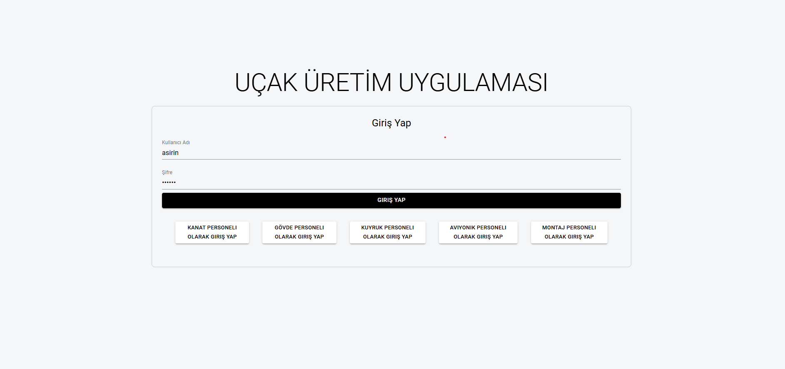
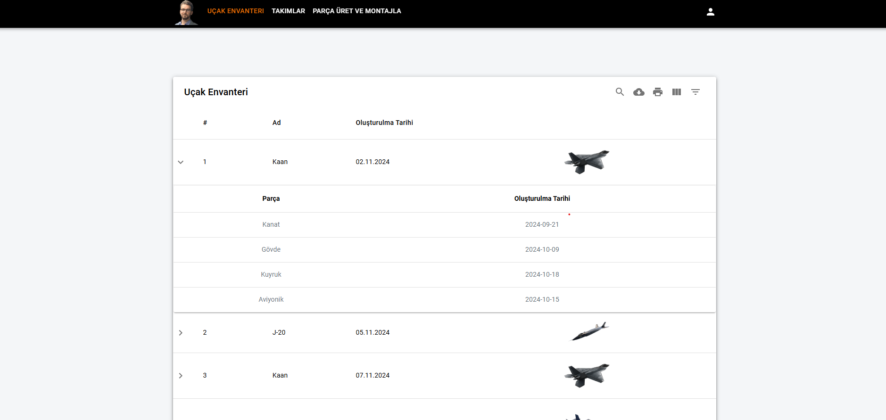
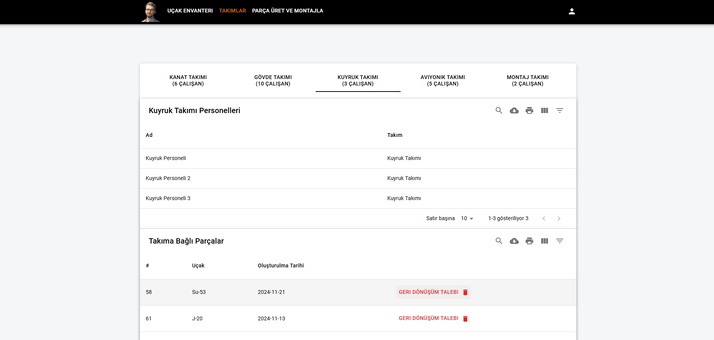
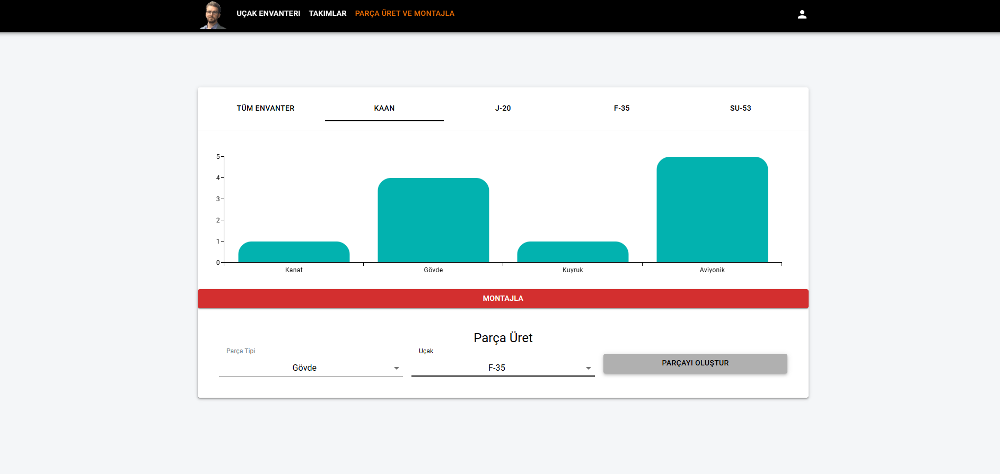
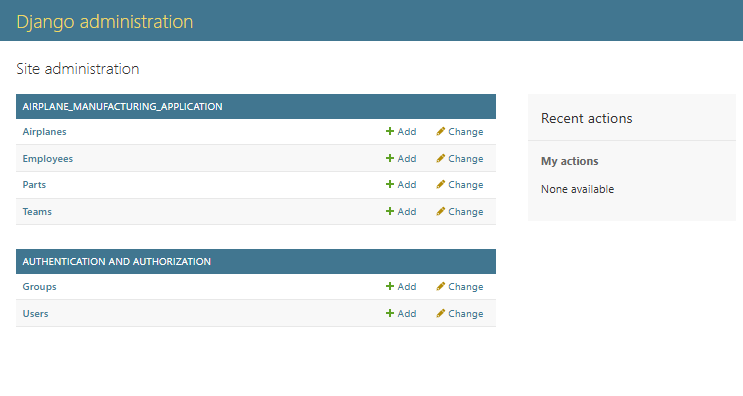
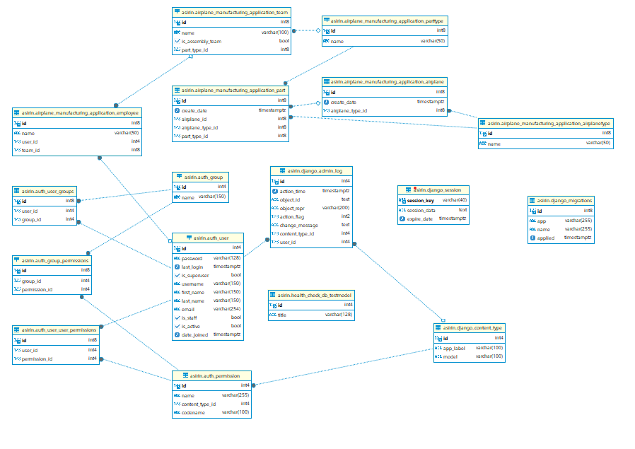
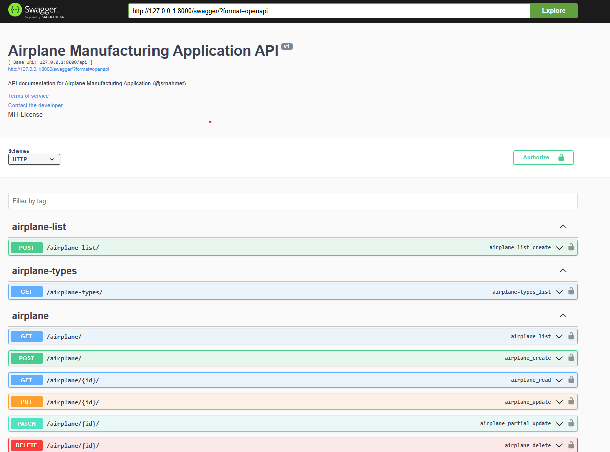

# Uçak Üretim Uygulaması / Ahmet Şirin

Merhaba,  

Bu proje yaklaşık 2-3 gün içerisinde baştan sona yapılan bir DEMO envanter projesidir. Amacı birden fazla teknolojinin iç içe çalışabilme yeterliliklerinin görülebilmesi ve oluşturulan web uygulamasının bir bakıma POC anlamı taşımasıdır. 

İş yoğunluğumdan dolayı projeyi olabildiğince hızlı bir şekilde gerçekleştirdim. Bu sebeple Clean Code prensiplerine uyamadım. Bazı eksiklikler ve düzensizliklerin farkındayım :)

**Uygulama içeriği hakkında görseller __ICERIK__ adlı klasör içerisinde mevcut.

İyi günler dilerim!

# Giriş

# Uçak Envanteri

# Takımlar

# Parça Üret ve Montajla

# Admin Panel

# Veritabanı Diyagramı

# Swagger

---

## Docker

Uygulamanın docker ile ayağa kalkabilmesi için komutu uygulama ana dizininde çalıştırın:
-  docker-compose up --build

Docker ile ayağa kalkabilmesi için backend\backend\settings.py dosyasında veritabanı host bilgisini "db" olarak tanımladım. Eğer uygulama masaüstü çalışmalarda docker kullanılmadan, doğrudan kullanılacaksa veritabanı bilgilerinin değişmesi gerekiyor.

## Teknolojiler

Bu proje, **Django** ve **ReactJS** kullanılarak geliştirilmiştir. Hem **backend** hem de **frontend** tarafında kapsamlı özellikler barındırmaktadır.

### Frontend
- **ReactJS** ile geliştirilmiş olan kullanıcı arayüzü, dinamik ve responsive bir tasarıma sahiptir.
- **Materialized UI** stil kütüphanesi kullanılmıştır. Bootstrap yerine, zaman kısıtlaması nedeniyle daha aşina olduğum teknolojilere odaklandım.
- Frontend'i çalıştırmak için (frontend klasörü dizininde yazılması gerekmektedir):
  1. `npm install` komutunu çalıştırarak bağımlılıkları yükleyin.
  2. `npm start` komutunu çalıştırarak uygulamayı başlatın.
  
  Tarayıcıda **localhost:3000**'de çalışması önerilir.

### Backend
- **Django** kullanarak geliştirilmiş olan backend, PostgreSQL veritabanına bağlanmaktadır.
- PostgreSQL veritabanı localde, **username: asirin** ve **password: asirin** ile **port: 5432**'de tanımlıdır.

## Proje Kurulumu

### 1. Veritabanı Kurulumu

Projenin veritabanı PostgreSQL üzerinde çalışmaktadır. Aşağıdaki adımları takip ederek veritabanını başlatabilirsiniz:

1. PostgreSQL'e bağlantı sağlayın.
2. **db**:postgres, **schema**:asirin, **username**: asirin, **password**: asirin olarak veritabanı kullanıcı bilgilerini kullanın.
3. Port **5432**'yi kullanarak bağlantıyı kurun.

### 2. Django Projesi Kurulumu

Django projesini başlatmak için gerekli komutları aşağıda bulabilirsiniz (backend klasörü dizininde yazılması gerekmektedir):

1. **Virtual Environment (venv) Oluşturma**:
   - `python -m venv venv`
   - windows için .\venv\Scripts\activate
   - MacOS/linux için source venv/bin/activate

2. Bağımlılıkları yükleyin:
   - `pip install -r requirements.txt`

3. Veritabanı tablolarını oluşturun:
   - `python manage.py migrate`

4. Varsayılan verileri oluşturun (Birim testi ve default veriler):
   - `python manage.py create_default_data`

5. Sunucuyu başlatın:
   - `python manage.py runserver`
   
   Proje lokalde, **http://127.0.0.1:8000** adresinde çalışacaktır.

### 3. Superadmin ve Kullanıcılar

- **Superadmin** kullanıcı adı: **asirin**, şifre: **asirin**.
- Django projesinde birden fazla kullanıcı bulunmaktadır ve **superadmin** kullanıcısı tüm işlemleri gerçekleştirebilir.
- Diğer personeller, sadece yetki alanlarına göre CRUD işlemleri yapabilirler.

### 4. API Kullanımı

Uygulamada **REST API** servisleri kullanılmakta olup, **Swagger** ile tüm API dokümantasyonu sağlanmıştır. Swagger arayüzüne şu adres üzerinden ulaşabilirsiniz:
- **Swagger**: [http://127.0.0.1:8000/swagger/](http://127.0.0.1:8000/swagger/)

### 5. Özellikler ve Fonksiyonellik

- **Asenkron ve senkron fetch işlemleri** ile veri alımı yapılır.
- **Server-side datatable** kullanılarak veriler sayfalama yapılmış şekilde gösterilir.
- Kullanıcı arayüzü **özelleştirilmiş araçlar** ve **gelişmiş filtreleme** seçenekleri sunmaktadır.
- **Dinamizm**: Tüm ilişkili veriler ayrı tablolarda tutulur ve dinamik olarak uygulama içerisinde kullanılır.
- **JWT Token** ile güvenli kullanıcı yetkilendirmesi sağlanır.
  - **Superadmin** kullanıcısı tüm işlemleri gerçekleştirebilir.
  - **Personel** sadece kendi yetkileri dahilinde CRUD işlemleri yapabilir.
- Uygulama içerisindeki veriler, personellerin yetkilerine göre filtrelenir ve bu kısıtlamalar hem frontend hem de backend tarafında uygulanır.

## Kullanıcı Arayüzü

Proje içerisinde **5 farklı takım tipi** için kullanıcı girişi yapılabilir. Giriş ekranında, her takım için hazır giriş butonu bulunmakta, ancak kullanıcı adı ve şifre girerek de giriş yapılabilir. Uygulama **data-table** kullanarak **sayfalama**, **filtreleme**, **arama** ve **sıralama** gibi özellikler sunmaktadır.

### Arayüz Özellikleri
- Kullanıcıya özelleştirilmiş araçlar ve arayüz tasarımı.
- **Paging yapılı datatable** API servisleri.
- Uygulamanın arayüzünde **filtreleme** ve **özelleştirme** seçenekleri.
- Uygulama, kullanıcıya sadece kendi yetkisi dahilindeki verilere erişim izni verir.

## Veritabanı İlişkileri

Tüm ilişkili veriler, birbirinden bağımsız tablolarda oluşturulmuştur. Bu sayede dinamik olarak kullanıcılar, takımlar, parçalar ve diğer ilişkili veriler uygulama içerisinde kullanılabilir.

## Sonuç

Uygulama, **JWT Token** tabanlı yetkilendirme ile güvenli bir kullanıcı deneyimi sunar. Superadmin kullanıcıları tüm işlemleri yapabilirken, personel sadece kendi yetkileri dahilinde işlem yapabilmektedir. Arayüzdeki özelleştirilmiş filtreler ve araçlar, kullanıcı deneyimini iyileştirir.

Uygulama, veritabanında dinamik olarak güncellenen verilere dayanarak çalışır ve ilişkili verilerden faydalanır.

---

İyi çalışmalar dilerim!